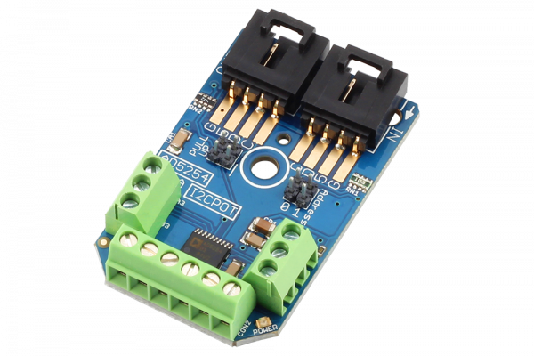

[](https://store.ncd.io/product/analog-devices-ad5254-digital-potentiometer-4-channel-256-position-i2c-mini-module/).

# AD5254

The AD5254 (from Analog Devices) offers an ideal solution for most digital potentiometer applications. Learn how to use the AD5254 using our I2C Mini Module and take control of 4 on-board I2C controlled potentiometers, each with 256 taps.  Choose from 1K, 10K, 50K, and 100K digital potentiometers when adding to your cart. The AD5254 supports wiper read-back, allowing you to easily read the current wiper settings.
This Device is available from www.ncd.io

[SKU: AD5254]

(https://store.ncd.io/product/analog-devices-ad5254-digital-potentiometer-4-channel-256-position-i2c-mini-module/)
This Sample code can be used with Raspberry Pi.

Hardware needed to interface AD5254 4Channel Potentiometer With Raspberry Pi :

1. <a href="https://store.ncd.io/product/analog-devices-ad5254-digital-potentiometer-4-channel-256-position-i2c-mini-module/">AD5254 4Channel Potentiometer</a>

2.  <a href="https://store.ncd.io/product/i2c-shield-for-raspberry-pi-3-pi2-with-outward-facing-i2c-port-terminates-over-hdmi-port/">Raspberry Pi I2C Shield</a>

3. <a href="https://store.ncd.io/product/i%C2%B2c-cable/">I2C Cable</a>

## Python

Download and install smbus library on Raspberry pi. Steps to install smbus are provided at:

https://pypi.python.org/pypi/smbus-cffi/0.5.1

Download (or git pull) the code in pi. Run the program.

```cpp
$> python AD5254.py
```
The lib is a sample library, you will need to calibrate the sensor according to your application requirement.
